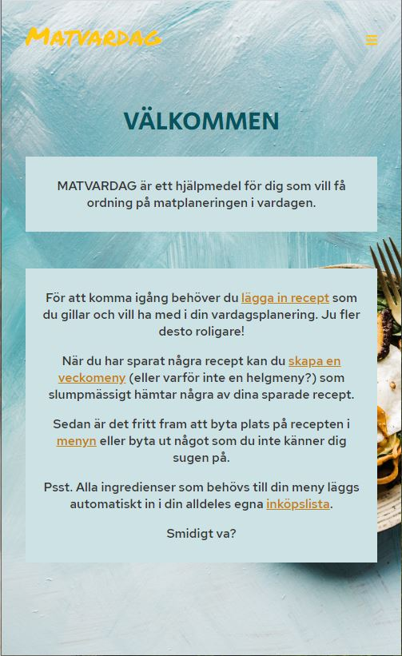

# matvardag

> A Vue.js project

> Mobile first design, please adjust window size

## Build Setup

``` bash
# install dependencies
npm install

# start server in terminal 1
node server.js

# serve with hot reload at localhost:8081 in terminal 2
npm run dev

```

## Screenshots

Home page when logged in



Add recipe page


Menu page


